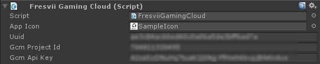

# Getting Started

1.  Import the Unity Package "gaming-cloud-sdk-unity-v.*.*.*.unitypackage" of the Fresvii Gaming Cloud SDK. (Choose "Assets" > "Import Package" > "Custom Package...".)

2.  Lay out the Fresvii Gaming Cloud prefab to the scene.

3.  Setup the following app information in the Fresvii Gaming Cloud inspector.

|Data|Type|Description|
|-------|------|-----|
|App Icon|Texture2D|Image of the app icon|
|Uuid|string|App ID of Fresvii Gaming Cloud|
|GcmProjectId|string|Project ID when using the Google Cloud Messaging for Android service|
|Gcm Api Key|string|API key when using the Google Cloud Messaging for Android service|
After setting up 1 through 3, you will be able to use the methods of the FGC class.

4. To use the sample GUI, add the "FresviiSampleGUI" prefab to the scene.

5. To use the Fresvii GUI, add scene "FresviiGUI" to the preferred scene in "Build Setting".

----------
## Build Setting in iOS

User information is saved by keychain with Fresvii Gaming Cloud SDK for Unity in iOS.
Thus, when building with Xcode, opne (Build Phases -> Link Binary With Libraries) and add "Security.framework".

----------
## Push Notification Icon Setting in Android

Replace the "push_icon.png" inside Assets/Plugins/Android/res/drawable with the same name.
"push_icon.png" will be the icon used in notification in status bar.